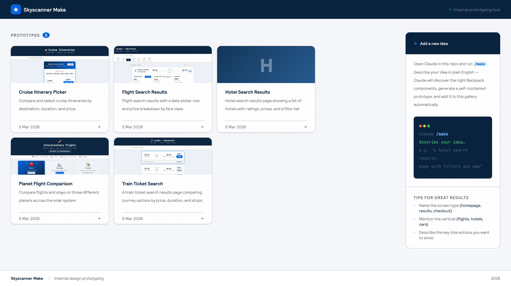

# Skyscanner Make

A Figma Make-style prototyping tool for Skyscanner product designers.
Describe an idea in plain English → Claude generates a working prototype using the [Backpack](https://backpack.github.io) design system → it's instantly live at a shareable sub-route.



---

## How it works

1. Open Claude Code in this repo
2. Run `/make`
3. Describe your idea in one or two sentences
4. Claude uses `backpack-cli` to discover the right Backpack components and tokens, then generates an isolated React prototype
5. Navigate to `/p/<your-idea-slug>` to see it running

The home page at `/` shows a gallery of every idea that has been generated.

---

## Getting started

```bash
npm install
npm run dev
```

Then open `http://localhost:5173` and run `/make` in Claude Code.

### Prerequisites

- [Claude Code](https://claude.ai/code) installed and authenticated
- [`backpack-cli`](https://github.com/Skyscanner/backpack-cli) — installed automatically on first use, or manually:
  ```bash
  npm install -g @skyscanner/backpack-cli
  backpack-cli update
  ```

---

## Project structure

```
src/
  pages/
    Home.jsx          # Gallery — lists all generated ideas
    ProjectView.jsx   # Renders a prototype at /p/:slug
  projects/
    <slug>/
      index.jsx       # The generated prototype component
      meta.json       # { slug, title, description, createdAt }
.claude/
  skills/make/
    SKILL.md          # The /make skill definition
```

Each prototype in `src/projects/` is:
- **Isolated** — its own directory, no shared state
- **Auto-discovered** — picked up by `import.meta.glob` with no manual registration
- **Self-contained** — wraps itself in `BpkProvider`, uses realistic placeholder data

---

## Stack

- [Vite 6](https://vitejs.dev) + [React 18](https://react.dev)
- [React Router](https://reactrouter.com)
- [Backpack](https://backpack.github.io) — Skyscanner's design system, pre-installed via `@skyscanner/backpack-web`
- [backpack-cli](https://github.com/Skyscanner/backpack-cli) — AI agent tool for discovering Backpack components and tokens

---

## Adding a prototype manually

Create two files:

**`src/projects/my-idea/meta.json`**
```json
{
  "slug": "my-idea",
  "title": "My Idea",
  "description": "A short description of what this prototype does.",
  "createdAt": "2026-03-05T00:00:00.000Z"
}
```

**`src/projects/my-idea/index.jsx`**
```jsx
import BpkProvider from '@skyscanner/backpack-web/bpk-component-provider';

export default function MyIdea() {
  return (
    <BpkProvider>
      {/* your prototype */}
    </BpkProvider>
  );
}
```

The dev server picks it up immediately — no restart needed.
